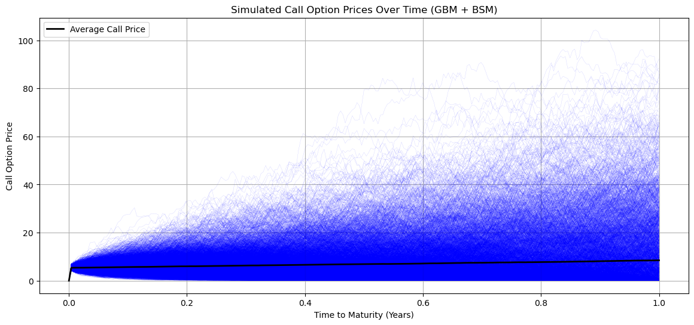
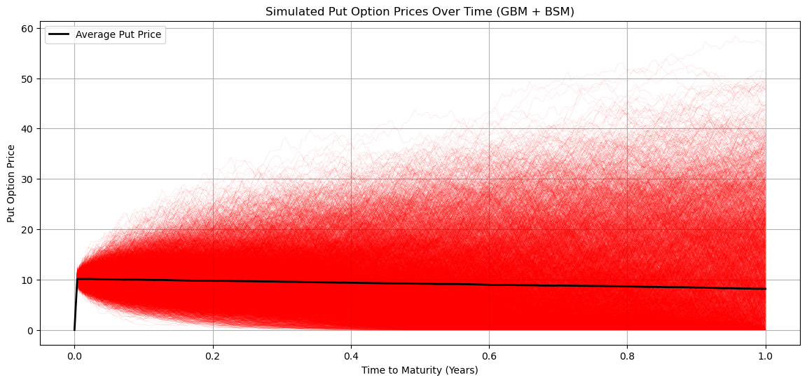

# Option Pricer (BSM Model)

This Python script implements the **Black-Scholes-Merton (BSM) model** for (European) options. It calculates option prices for both **continuous and discrete dividends**, computes **Greeks**, and visualizes option payoffs and Greeks in 3D.

## Features
- **Black-Scholes-Merton Pricing:** Computes call and put prices, integrating continuous and discrete dividend adjustments.
- **Greeks Calculation:** Delta, Gamma, Vega, Theta, and Rho for sensitivity analysis.
- **Comparison Table:** Side-by-side comparison of values for continuous vs. discrete dividend models.
- **Option Payoff Visualization:** Displays payoff graphs for long call and put strategies.
- **Monte Carlo Option Pricing:** Computes option prices through Monte Carlo simulation (GBM)
- **Differences in Option Prices :** Displays the price difference between BSM (continuous compounding) and Monte Carlo option prices.
- **3D Greeks Visualization:** Generates interactive 3D surface plots for all Greeks, including a consolidated view of all Greeks.

## Usage
1. Clone this repository or download the latest version of the script.
2. Ensure you have Python 3.12+ installed along with required libraries : **`numpy`, `pandas`, `scipy`, `matplotlib`**.
3. Run the script in your terminal or IDE
4. Follow the prompts to enter option parameters.

## Parameters
The script will prompt you to enter:
- **S_0:** Initial stock price (e.g., `100`).
- **K:** Strike price (e.g., `105`).
- **T:** Time to maturity in years (e.g., `1`).
- **rf:** Risk-free rate (as a decimal, e.g., `0.05` for 5%).
- **σ (sigma):** Implied volatility (e.g., `0.2`).
- **q:** Continuous dividend yield (as a decimal, `0` if none).
- **D:** Discrete dividend amount (optional for discrete model).
- **T_div:** Time when the discrete dividend is paid (must be `< T`).

### Input Example:
```
Enter the initial stock price (S_0): 100
Enter the strike price (S_K): 105
Enter the time to maturity (T in years): 1
Enter the risk-free rate (rf, as a decimal): 0.05
Enter the implied volatility (σ, sigma): 0.2
Enter the continuous dividend yield (q, as a decimal, 0 if none): 0

--- Discrete Dividend Option Pricing ---
Enter the discrete dividend amount (D): 0
```

## Output
After running the script, you will receive:
- A **comparison table** displaying option prices and Greeks for both continuous and discrete dividend models.
- **Monte Carlo simulated option prices**, showing average Call and Put prices at maturity.
- **Price deviation analysis** between Monte Carlo results and Black-Scholes model values.
- **Payoff visualization** for call and put options at expiry.
- **GBM Simulated Paths** demonstrating stochastic price evolution of the underlying asset.
- **3D Surface Plots** for all Greeks, including a combined plot for better comparison.

### Example Output:
```
--- Continuous Dividend Results---
  Metric      Call       Put
0  Price  8.021352  7.900442
1  Delta  0.542228 -0.457772
2  Gamma  0.019835  0.019835
3   Vega  0.396705  0.396705
4  Theta -0.017198 -0.003516
5    Rho  0.462015 -0.536776

--- Discrete Dividend Results---
  Metric      Call       Put
0  Price  8.021352  7.900442
1  Delta  0.542228 -0.457772
2  Gamma  0.019835  0.019835
3   Vega  0.396705  0.396705
4  Theta -0.017198 -0.003516
5    Rho  0.462015 -0.536776

--- Monte Carlo - Geometric Brownian Motion with Black-Scholes Model ---
Average Call Option Price at Maturity: 8.70
Average Put Option Price at Maturity: 8.39

--- Price Differences (BSM Continuous - Monte Carlo) ---
Call Option Price Difference: -0.6780
Put Option Price Difference: -0.4863
```
## Visualization
The script generates:
- **Payoff Plot** for call and put options.
- **Monte Carlo Path Simulation Plots for option prices** showing option price evolution.
- **Monte Carlo Option Pricing Plots** comparing BSM and simulated prices.
- **3D Greeks Surface Plots**, with a combined visualization for all Greeks.

## Examples




## Contributions
Contributions are welcome! Feel free to suggest improvements.

## Author
**Sacha D.**

## Disclaimer
This script is for educational purposes only and should not be used for financial decisions. The author assumes no responsibility for any actions taken based on the results of this script.
