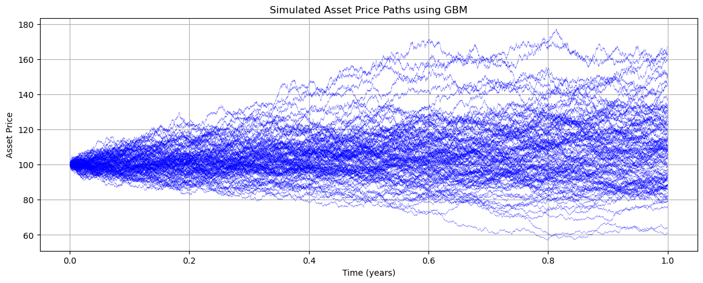
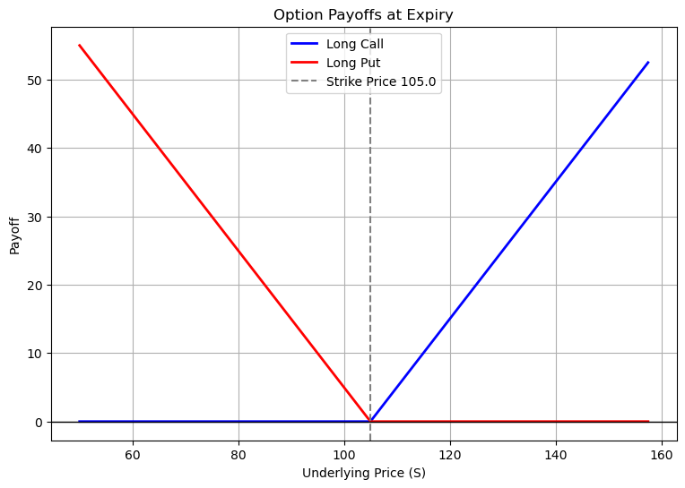
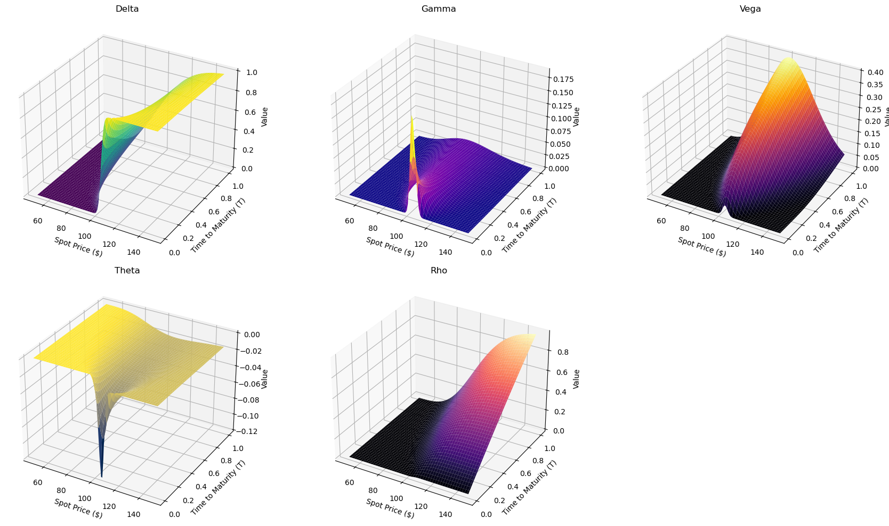

# Option Pricer (BSM Model)

This Python script implements the **Black-Scholes-Merton (BSM) model** for (European) options. It calculates option prices for both **continuous and discrete dividends**, computes **Greeks**, and visualizes option payoffs and Greeks in 3D.

## Features
- **Black-Scholes-Merton Pricing:** Computes call and put prices with continuous and discrete dividend adjustments.
- **Greeks Calculation:** Delta, Gamma, Vega, Theta, and Rho.
- **Comparison Table:** Displays values under continuous and discrete dividend adjustments.
- **Option Payoff Visualization:** Plots the payoff for long call and long put options.
- **GBM Path Simulation:** Simulates and visualizes Geometric Brownian Motion paths for asset price evolution.(no specific us at the moment)
- **3D Greeks Visualization:** Generates interactive 3D surface plots for all Greeks with a reference line at the current data point.

## Usage
1. Clone this repository or download the latest version of the script.
2. Ensure you have Python 3.12+ installed along with required libraries : **`numpy`, `pandas`, `scipy`, `matplotlib`**.
3. Run the script in your terminal or IDE
4. Follow the prompts to enter option parameters.

## Parameters
The script will prompt you to enter:
- **S_0:** Initial stock price (e.g., `100`).
- **K:** Strike price (e.g., `105`).
- **T:** Time to maturity in years (e.g., `1`).
- **rf:** Risk-free rate (as a decimal, e.g., `0.05` for 5%).
- **σ (sigma):** Implied volatility (e.g., `0.2`).
- **q:** Continuous dividend yield (as a decimal, `0` if none).
- **D:** Discrete dividend amount (optional for discrete model).
- **T_div:** Time when the discrete dividend is paid (must be `< T`).

### Input Example:
```
Enter the initial stock price (S_0): 100
Enter the strike price (S_K): 105
Enter the time to maturity (T in years): 1
Enter the risk-free rate (rf, as a decimal): 0.05
Enter the implied volatility (σ, sigma): 0.2
Enter the continuous dividend yield (q, as a decimal, 0 if none): 0

--- Discrete Dividend Option Pricing ---
Enter the discrete dividend amount (D): 0
```

## Output
After running the script, you will receive:
- A **table comparing** option prices and Greeks for continuous vs. discrete dividend models.
- **Payoff visualization** of call and put options at expiry.
- **GBM Simulated Paths** for underlying asset prices.
- **3D Surface Plots** for all Greeks. The last plot regroups all greek plots.

### Example Output:
```
--- Continuous Dividend Results---
  Metric      Call       Put
0  Price  8.021352  7.900442
1  Delta  0.542228 -0.457772
2  Gamma  0.019835  0.019835
3   Vega  0.396705  0.396705
4  Theta -0.017198 -0.003516
5    Rho  0.462015 -0.536776

--- Discrete Dividend Results---
  Metric      Call       Put
0  Price  8.021352  7.900442
1  Delta  0.542228 -0.457772
2  Gamma  0.019835  0.019835
3   Vega  0.396705  0.396705
4  Theta -0.017198 -0.003516
5    Rho  0.462015 -0.536776
```
Note : the outputs are the same for Continuous and Discrete due to the abscence of dividend.

## Visualization
The script generates:
- **Payoff Plot** for call and put options:
- **GBM Path Simulation Plot:**
- **3D Greeks Surface Plots:**

## Examples




## Contributions
Contributions are welcome! Feel free to suggest improvements.

## Author
**Sacha D.**

## Disclaimer
This script is for educational purposes only and should not be used for financial decisions. The author assumes no responsibility for any actions taken based on the results of this script.
